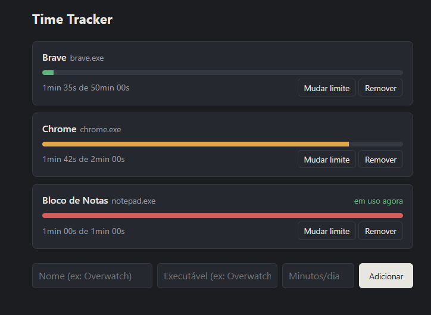

# Time Tracker

Controle de tempo de uso de programas e jogos no Windows. Você define um limite diário por aplicativo; o app conta só o tempo em que ele está em **primeiro plano** e avisa com uma notificação do sistema ao passar do limite.



## Como funciona

- Detecta o aplicativo em primeiro plano pela API do Windows (JNA).
- Uma tarefa agendada soma o tempo ao app cujo executável está em foco.
- O uso zera na virada do dia.
- A barra de cada app muda de cor conforme chega perto do limite (verde, âmbar, vermelho).
- Ao passar do limite, mostra uma notificação do sistema: *"Tempo esgotado: você atingiu o limite diário de X"*.
- API REST (CRUD de apps e limites), persistência com JPA/H2 e interface web simples servida pelo próprio Spring Boot.

## Stack

Java, Spring Boot, JPA/Hibernate, H2, JNA, Maven.

## Como rodar

Requer JDK 21 ou superior.

```bash
mvn clean package
java -jar target/time-tracker-backend-0.1.0.jar
```

Depois abra `http://localhost:8080` e cadastre cada aplicativo pelo nome do executável (por exemplo `notepad.exe`), que aparece na aba Detalhes do Gerenciador de Tarefas.

No meu uso pessoal, o backend sobe junto com o Windows e um atalho na área de trabalho abre a interface em janela própria.

## Limitações

- Só funciona no Windows (usa a API nativa do Windows para achar a janela em foco).
- Conta o tempo enquanto o app está em foco, mesmo sem atividade (não detecta ociosidade).
- Programas protegidos por anti-cheat podem impedir a leitura do processo.
- O tempo só é medido enquanto o Time Tracker está em execução.
- Projeto de uso pessoal, feito para rodar local.
